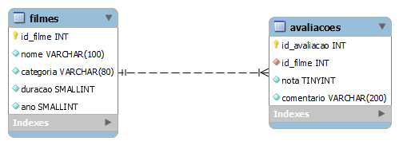

# Blockbuster - MEGADADOS Projeto 1

## Desenvolvimento do projeto

Para testar a API na máquina, rodar o seguinte comando no terminal:

    uvicorn sql_app.main:app --reload

No qual:

- `sql_app.main`: nome do arquivo `main.py` que está no subdiretório `sql_app`;
- `app`: objeto criado dentro do arquivo `main.py` na linha `app = FastAPI()`;
- `--reload`: faz o servidor recarregar quando há mudanças (apenas para desenvolvimento).

Para acessar no WebBrowser as funcionalidades da API e realizar as requisições através de uma interface visual:

- localhost:8000/docs

## Protótipo inicial da API

[Link](https://youtu.be/x6H8JLdpoqA) para demonstração da API desenvolvida em Python com o framework FastAPI e sem integração com base de dados.

## Versão completa da API

A API RESTFul foi projetada para se comunicar com um banco de dados em um servidor MySQL, realizando cada uma das operações CRUD e retornando ao usuário respostas coerentes com as ações realizadas. Abaixo está diagrama usado para modelar o banco de dados:

[Link](https://youtu.be/xASq6oCNMjE) para demonstração da API RESTFul desenvolvida em Python com o framework FastAPI e integração com base de dados MySQL.

## Referências

[FastAPI Docs](https://fastapi.tiangolo.com/)

[Uvicorn](https://www.uvicorn.org/)

[Status Code](https://www.restapitutorial.com/httpstatuscodes.html)

[Notion - Bloco de Notas do Grupo](https://juniper-condor-453.notion.site/Projeto-BlockBuster-2e755cab08d94bcb8cdefe871d6d212d)

[SQLAlchemy Docs](https://docs.sqlalchemy.org/en/20/orm/)
